# 基于 SFT 微调 Qwen2.5-1.5B 模型的医学文本实体节点提取实验报告

---

## 1. 背景介绍

### 1.1 任务背景

医学知识图谱（Medical Knowledge Graph）的结构化构建是医学自然语言处理领域的核心挑战之一。从非结构化的医学指南文本中自动提取实体节点（如疾病、药物、症状、检查指标等），是构建医学知识图谱的关键前置步骤。传统方法依赖大量人工标注，成本高昂且扩展性有限。近年来，大语言模型（LLM）在信息抽取任务上展现出强大的语义理解能力，使得利用较小规模的模型（如 1.5B 参数级别）进行领域微调成为可行方案。

### 1.2 项目背景

本项目旨在从中文医学指南（涵盖高血压、糖尿病等慢性疾病领域）的原始文本中，自动提取结构化的医学实体节点。原始标注数据来自多份中国医学专家共识和防治指南的 PDF 文档，经由文本提取和分块处理后形成训练语料。然而，由于以下客观原因，模型无法完全复现标注数据集的结构化输出：

- 标注者的个人习惯导致命名规则不一致
- PDF 中的图片/表格信息在转为纯文本时丢失，导致文本与标注数据之间存在天然偏差

基于以上约束，项目采用 **SFT（Supervised Fine-Tuning）+ GRPO（Group Relative Policy Optimization）** 两阶段训练策略：第一阶段使用 SFT 对基座模型进行监督微调，使其具备基本的节点提取能力；第二阶段使用 GRPO 结合基于规则的奖励函数进一步优化输出质量。本报告聚焦于第一阶段的 SFT 实验。

### 1.3 实体类型定义

模型需要从医学文本中识别以下 11 类医学实体节点：

| 类别 | 示例 |
|------|------|
| 疾病 | 高血压、2型糖尿病、动脉粥样硬化 |
| 检查检验 | 糖尿病（检验项）、高血压（检查项） |
| 检查指标 | 血压、体重、呼吸 |
| 检验指标 | 血糖、胰岛素、蛋白质 |
| 体征和症状 | 头晕、头痛、水肿、超重 |
| 药物药剂 | 二甲双胍、噻嗪类利尿剂、α受体阻滞剂 |
| 治疗方式 | 运动治疗、降压药治疗、胰岛素泵治疗 |
| 个人史概念 | 吸烟、饮酒 |
| 过敏史概念 | 药物过敏 |
| 家族史概念 | 高血压家族史 |
| 人群 | 老年人、孕妇 |

---

## 2. 方法

### 2.1 基座模型

选用 **Qwen2.5-1.5B-Instruct** 作为基座模型。该模型为通义千问系列的中文指令微调模型，拥有 15 亿参数，在中文理解和生成任务上表现优异，且参数量适中，适合在单卡 GPU 环境下进行微调和部署。

### 2.2 微调策略：QLoRA

为在有限显存条件下实现高效微调，本实验采用 **QLoRA（Quantized Low-Rank Adaptation）** 技术，具体配置如下：

- **INT4 量化加载**：使用 `bitsandbytes` 库的 NF4 量化格式加载基座模型，并启用双重量化（Double Quantization）进一步降低显存占用
- **LoRA 适配器**：在模型的注意力投影层（`q_proj`, `k_proj`, `v_proj`, `o_proj`）和前馈层（`gate_proj`, `up_proj`, `down_proj`）上添加低秩适配器
- **LoRA 超参数**：秩 $r=16$，缩放系数 $\alpha=32$，Dropout 率 $=0.05$
- **混合精度训练**：BF16（Brain Float 16）
- **梯度检查点**：启用以优化显存，`use_reentrant=False`

### 2.3 Prompt 模板

采用 Qwen2.5 的 ChatML 格式构建指令微调数据：

```
<|im_start|>system
你是一个医学知识图谱实体提取助手。从给定的医学文本中，识别并提取所有医学实体节点。实体类型必须严格从以下类型中选择：```个人史概念、过敏史概念、家族史概念、疾病、检查检验、检查指标、检验指标、人群、体征和症状、药物药剂、治疗方式```以 JSON 格式输出，格式为 {"nodes": [{"name": "...", "type": "..."}, ...]}。<|im_end|>
<|im_start|>user
请从以下医学文本中提取所有实体节点：

{text_chunk}<|im_end|>
<|im_start|>assistant
```

模型仅在 `assistant` 回复部分计算损失（Loss Masking），`system` 和 `user` 部分的 token 标签设为 $-100$。

### 2.4 训练配置

| 参数 | 值 |
|------|-----|
| 训练轮数 | 3 epochs |
| 学习率 | $2.0 \times 10^{-4}$ |
| 学习率调度 | Cosine Annealing |
| Warmup 比例 | 3% |
| 优化器 | Paged AdamW 8-bit |
| 单卡 Batch Size | 4 |
| 梯度累积步数 | 4 |
| 等效 Batch Size | 16 |
| 最大序列长度 | 2048 tokens |
| 梯度裁剪 | $\max\_grad\_norm = 1.0$ |
| 随机种子 | 42 |
| 注意力加速 | Flash Attention 2 |

### 2.5 训练监控

训练过程通过 TensorBoard 记录以下指标：
- 训练集 Loss / 验证集 Loss
- 验证集困惑度（PPL = $\exp(\text{eval\_loss})$）
- L2 梯度范数
- 学习率变化曲线
- Token 吞吐量（tokens/s）
- GPU 显存占用

### 2.6 算法流程

整体技术方案采用 **SFT + GRPO 两阶段训练流程**，如下图所示：

```mermaid
flowchart TD
    A["📄 PDF 医学指南文档"] --> B["文本提取与滑动窗口分块"]
    B --> C["构建 SFT 数据集<br/>(文本块-节点非对称Jaccard匹配)"]
    C --> D["<b>Stage 1: SFT 监督微调</b><br/>QLoRA &#43; Qwen2.5-1.5B-Instruct<br/>SFTTrainer"]
    D --> E["💾 SFT LoRA 权重<br/>(qwen-sft-text2node)"]
    E --> F["构建 GRPO 数据集<br/>(复用文本块, 移除标签依赖)"]
    F --> G["<b>Stage 2: GRPO 强化微调</b><br/>QLoRA 加载 SFT 权重为起点<br/>GRPOTrainer + 规则奖励函数"]
    G --> H["💾 GRPO LoRA 权重<br/>(qwen-grpo-text2node)"]
    H --> I["📊 模型评估<br/>精确率 / 召回率 / 结构正确率"]

    subgraph RF["🔧 奖励函数 (驱动 GRPO)"]
        R1["① 结构得分: JSON 格式校验"]
        R2["② 文本匹配度: L0→L1→L1.5→L2"]
        R3["③ 数据集匹配度: node.json 知识库"]
    end

    G -.->|"批量评分"| RF
```



流程概要说明：

1. **数据准备阶段**：从 PDF 医学指南中提取纯文本，经滑动窗口分块后，使用非对称 Jaccard 匹配算法将文本块与预定义节点集合（`node.json`）进行标注对齐，生成 SFT 训练数据
2. **SFT 阶段**：使用 QLoRA 在 Qwen2.5-1.5B-Instruct 上进行监督微调，使模型掌握基本的节点提取能力和 JSON 格式输出规范
3. **GRPO 阶段**：以 SFT 权重为起点，使用 TRL GRPOTrainer 进行强化微调。奖励函数由结构得分、文本匹配度、数据集匹配度三个组件加权构成（详见第 5.4 节），完全不依赖标注标签直接监督
4. **评估阶段**：对最终模型在测试集上计算精确率、召回率、结构正确率等指标

---

## 3. 实验设置

### 3.1 数据集构建

**数据源**：14 份中文医学指南文档（涵盖高血压防治指南、2型糖尿病防治指南、糖尿病专家共识等），经 PDF 转 TXT 处理后，使用滑动窗口分块算法切分为文本片段。

**分块参数**：
- 最大块长度：1000 字符
- 最小重叠长度：500 字符
- 启用文本过滤清洗

**节点匹配**：使用非对称 Jaccard 匹配算法，将文本块与预定义节点集合（`node.json`，包含数千个医学实体）进行匹配，匹配阈值 0.9。匹配上的节点作为正样本标签，同时按比例（20%）生成负样本（文本中无匹配节点）。

**数据划分**：按 $60\%:10\%:30\%$ 的比例随机划分为训练集、验证集和测试集，随机种子 42。最终训练集约 535 条样本，验证集约 89 条，测试集 272 条。

### 3.2 评估指标

测试阶段，对每条测试样本计算以下指标（要求预测节点与标签节点的 `(name, type)` 二元组完全一致才算命中）：

**逐样本指标**：
- **精确率（Precision）**：$\frac{\text{正确预测节点数}}{\text{模型预测节点总数}}$
- **召回率（Recall）**：$\frac{\text{正确预测节点数}}{\text{标签节点总数}}$
- **长度差（Length Diff）**：$|\text{预测节点数} - \text{标签节点数}|$

**聚合指标**：
- **结构正确率（Struct Accuracy）**：输出可解析为有效 JSON 的样本占比
- **单样本精确率均值与标准差**
- **单样本召回率均值与标准差**
- **单样本长度差均值与标准差**
- **整体精确率（Overall Precision）**：$\frac{\sum \text{正确预测数}}{\sum \text{预测节点数}}$
- **整体召回率（Overall Recall）**：$\frac{\sum \text{正确预测数}}{\sum \text{标签节点数}}$
- **类型准确率（Type Accuracy）**：在所有正确预测的节点中，类型也正确的比例

### 3.3 推理设置

- 使用与训练一致的 INT4 量化 + LoRA 适配器加载模型
- 采样策略：`do_sample=True`，温度 $T=0.1$，Top-p $=0.9$
- 最大生成 token 数：1024
- 对截断 JSON 具备容错修复能力（自动括号闭合）

---

## 4. 实验结果与分析

### 4.1 总体结果

| 指标 | 数值 |
|------|------|
| 测试样本总数 | 272 |
| 成功解析样本数 | 258 |
| 结构正确率 | **94.85%** |
| 单样本精确率均值 ± 标准差 | **0.5366 ± 0.3468** |
| 单样本召回率均值 ± 标准差 | **0.4038 ± 0.2900** |
| 单样本长度差均值 ± 标准差 | **3.03 ± 3.25** |
| 整体精确率 | **0.6061** |
| 整体召回率 | **0.4592** |
| 类型准确率 | **1.0000** |

### 4.2 结构正确率分析

结构正确率达到 $94.85\%$，表明经过 SFT 微调后，模型已充分学习到 Qwen2.5 的 ChatML 对话格式和 JSON 输出规范。258/272 条样本的输出能被正确解析。14 条解析失败的样本主要集中在 JSON 格式不完整（如生成被截断）或键名不规范的情况。

### 4.3 精确率与召回率分析

**整体精确率 60.61%，整体召回率 45.92%**，说明模型在当前阶段具备一定的节点提取能力，但整体命中率仍有提升空间。

从单样本维度看：
- 单样本精确率均值为 $0.5366$（标准差 $0.3468$），说明不同样本之间的预测质量波动较大。部分样本的预测节点几乎全部命中标签（精确率接近 1.0），但也有不少样本的预测中含有较多标签外的节点
- 单样本召回率均值为 $0.4038$（标准差 $0.2900$），说明模型倾向于"漏提"而非"多提"——即模型通常输出较少的节点，未能覆盖标签中的所有节点

从典型样本分析来看：
- **高精确率低召回率场景**（如 `sample_idx=405`，精确率 1.0 / 召回率 0.25）：模型输出 4 个药物名称全部命中，但遗漏了 12 个其他类型的节点。说明模型对某些高频出现的实体类型（如药物药剂）有较强的识别能力，但对标签中的多样化实体覆盖不足
- **低精确率低召回率场景**（如 `sample_idx=109`，精确率 0.33 / 召回率 0.33）：模型输出了 6 个节点但仅命中 2 个，同时标签 6 个节点中也仅命中 2 个。此情况常出现在文本信息密度高、实体命名多样化的复杂段落

### 4.4 长度差分析

单样本长度差均值为 $3.03$（标准差 $3.25$），表明模型预测的节点数与标签节点数之间存在一定偏差。结合召回率偏低的现象，可推断模型总体上倾向于输出更少的节点——这一方面可能与 SFT 训练数据的节点分布有关（部分文本块匹配到的节点数量较少），另一方面也反映出模型在保守预测与全面覆盖之间的权衡。

### 4.5 类型准确率分析

**类型准确率高达 100%**，这是一个非常积极的信号！在所有被正确预测命中的节点中，模型对实体类型的分类完全正确。这说明 SFT 训练使模型充分掌握了 11 种实体类型的语义边界，不会出现把"疾病"误分类为"药物药剂"等类型混淆的情况。

### 4.6 典型错误模式

通过分析 `sft_node_test_details.json` 中的具体样本，可归纳以下典型错误模式：

1. **实体遗漏**：模型未能提取文本中的低频实体或嵌套实体（如"青少年隐匿性自身免疫糖尿病"、复杂的检验指标名称）
2. **幻觉生成**：模型有时会从文本中抽取到标注数据中不存在的实体（如 sample_idx=587 中模型预测了"男"类型为"未知"，但实际类型列表中无此类别）
3. **负样本处理**：对于标签为空节点列表的负样本，模型仍可能输出一些节点，反映出对"无实体可提取"场景的学习不足
4. **命名一致性差异**：模型对同一概念的命名方式与标注者不同（如模型输出"β‑糖苷酶抑制剂"，但标签中无此节点，仅有"α‑糖苷酶抑制剂"），这体现了标注者的个人命名偏好与模型语义理解之间的偏差

### 4.7 总结

本次 SFT 实验使用 QLoRA 技术在 Qwen2.5-1.5B-Instruct 基座模型上进行监督微调，实现了从医学文本中提取结构化实体节点的目标。实验结果表明：

- **格式遵循能力优秀**：结构正确率 $94.85\%$，类型准确率 $100\%$，模型已稳定掌握输出规范
- **实体召回有待提升**：整体召回率 $45.92\%$，模型倾向于保守预测，遗漏较多实体
- **精确率中等**：整体精确率 $60.61\%$，存在一定比例的无关输出
- **后续优化方向**：可通过第二阶段 GRPO 训练结合基于规则的奖励函数（格式奖励 + 文本匹配奖励 + 数据集匹配奖励），进一步引导模型提升实体覆盖率和输出精度

---

## 5. 第二阶段扩展：GRPO 强化微调

> **重要提示**：由于本次 GRPO 训练发生了严重的模型崩溃（详见第 5.6–5.7 节），节点提取能力相比 SFT 阶段大幅退化。因此，本章后续关于 GRPO 设计思路与方法论的说明，仅代表该扩展流程的**可行技术方向**，并不代表已被验证有效的优化路径。第 5.7 节对奖励函数缺陷的诊断才是本章的核心结论。

在第一阶段 SFT 使模型掌握基本节点提取能力后，项目进入第二阶段 **GRPO（Group Relative Policy Optimization）** 强化微调。本节对 GRPO 阶段的设计与方法进行说明，并在第 5.6–5.7 节对训练结果及其问题进行深入分析。

### 5.1 为什么需要 GRPO

SFT 阶段存在以下固有限制，需要通过强化学习范式加以突破：

1. **标注偏差无法通过 SFT 消除**：如 1.2 节所述，标注者的个人命名习惯与 PDF 图表信息丢失，导致 `(text, completion)` 标签对存在天然噪声。SFT 强制模型模仿这些标签，但 GRPO 仅将标签作为奖励信号的参考之一，模型拥有更大的探索自由度
2. **SFT 的"保守预测"倾向**：SFT 阶段模型倾向于输出较少的节点（召回率仅 45.92%），以避免生成错误实体而受到交叉熵惩罚。GRPO 通过群体相对比较机制，鼓励模型在保证精度的前提下提升实体覆盖率
3. **超越标注数据的泛化**：GRPO 的目标不是完美复现标注数据集，而是使模型按照人类的思路从文本中得出结构合理、与文本一致、与知识库近似匹配的输出——即使输出的实体命名和数量与标注不完全一致，只要满足格式、文本一致性和知识库匹配度即可接受

### 5.2 GRPO 算法概述

GRPO（Group Relative Policy Optimization）是 TRL 库提供的一种在线策略优化算法。其核心思想为：

- 对每个输入 prompt，模型采样生成 $G$ 个候选 completion（本实验 $G=8$）
- 使用奖励函数对每个候选进行评分
- 以组内候选的相对优势（Advantage）替代绝对奖励值进行策略梯度更新——将组内奖励均值作为基线，计算每个候选的相对优势
- 引入 KL 散度惩罚项（系数 $\beta=0.04$），约束策略不偏离 SFT 参考模型过远，防止灾难性遗忘

与 PPO 相比，GRPO 无需训练独立的 Critic（价值网络），直接利用组内相对比较计算优势，在大幅降低显存和计算开销的同时保持了训练稳定性。

### 5.3 模型加载与训练配置

**起点模型**：以第一阶段 SFT 微调后的 LoRA 适配器（`qwen-sft-text2node`）作为 GRPO 的初始化权重，在此基础上注入新的 LoRA 层进行训练。

**加载方式**：与 SFT 阶段一致，采用 INT4 QLoRA（NF4 量化 + 双重量化 + BF16），确保在单卡 GPU 环境下可运行。

**关键训练参数**（与 SFT 阶段对比）：

| 参数 | SFT 阶段 | GRPO 阶段 |
|------|----------|-----------|
| 训练轮数 | 3 epochs | 1 epoch |
| 学习率 | $2.0 \times 10^{-4}$ | $5.0 \times 10^{-5}$ |
| Warmup 比例 | 3% | 10% |
| 单卡 Batch Size | 4 | 8 |
| 梯度累积步数 | 4 | 4 |
| 每 prompt 候选数 | — | 8 |
| KL 惩罚系数 | — | 0.04 |
| 采样温度 | 0.1（推理） | 1.0（训练） |
| 最大生成长度 | 1024 tokens | 256 tokens |
| 最大 Prompt 长度 | 2048 tokens | 1024 tokens |

GRPO 阶段学习率降低至 SFT 的 $1/4$，温度提高至 1.0 以增强探索多样性；最大生成长度缩减至 256 tokens（节点 JSON 输出通常较短），prompt 长度缩减至 1024 tokens 以减少 KV Cache 占用。

### 5.4 奖励函数设计

GRPO 训练完全由基于规则的奖励函数（Reward Function）驱动，不依赖标注标签直接监督。奖励函数由四个组件加权求和构成：

$$R_{\text{total}} = w_1 \cdot R_{\text{structure}} + w_2 \cdot R_{\text{length\_penalty}} + w_3 \cdot R_{\text{text\_matching}} + w_4 \cdot R_{\text{dataset\_matching}}$$

默认权重设置为 $w_1=0.2$，$w_2=0.0$，$w_3=0.6$，$w_4=0.2$（长度惩罚权重为 0，当前不启用）。

#### 5.4.1 结构得分（$R_{\text{structure}}$）

评估模型输出的 JSON 格式合规性：

| 场景 | 得分 |
|------|------|
| 可直接解析，关键字 `nodes`/`name`/`type` 全正确 | 1.0 |
| 可直接解析，但关键字有误（如 `node`/`Name`/`TYPE`） | 0.5 |
| 被截断，经括号闭合修复后可解析，关键字正确 | 0.8 |
| 被截断，经括号闭合修复后可解析，关键字有误 | 0.4 |
| 完全不可解析（非 JSON 或无 `nodes` 列表） | 0.0 |

结构得分为 0 的样本直接获得总奖励 0，不再进入后续评分流程。

#### 5.4.2 文本匹配度（$R_{\text{text\_matching}}$）

验证模型输出的每个节点是否能在输入文本中找到依据。采用分级匹配策略，逐级筛选剩余节点：

- **L0 匹配**：节点名称在文本中精确出现
- **L1 匹配**：节点名称经分词和归一化后完全匹配
- **L1.5 匹配**：考虑数值范围上下文的模糊匹配（如"血糖 7.0-11.1mmol/L"匹配"血糖 7.0mmol/L"），基于对称 Jaccard + 上下文窗口
- **L2 匹配**：基于 token 级别的对称 Jaccard 相似度匹配

最终文本匹配得分为所有节点匹配得分的均值。

#### 5.4.3 数据集匹配度（$R_{\text{dataset\_matching}}$）

衡量模型输出节点与标准知识库 `node.json`（包含数千个已标注医学实体）的相似度：

- 对每个预测节点，先以精确名称在标准节点集中查找（命中得满分 1.0）
- 剩余节点使用 L2 对称 Jaccard 模糊匹配，初始阈值 $th=0.5$，采用自适应阈值提升策略——匹配到高于当前阈值的节点后，上调阈值至该匹配分，累计命中 $x=5$ 次后停止搜索，取最高匹配分作为该节点的数据集匹配得分
- 最终数据集匹配得分为所有节点匹配得分的均值

该组件引导模型输出与已有知识体系中实体命名相近的结果，同时不会因标注者的命名差异而过度惩罚。

### 5.5 训练监控

GRPO 训练通过 TensorBoard 记录以下专有指标（在 SFT 阶段指标之外）：

| 指标类别 | 具体指标 |
|----------|----------|
| 奖励相关 | 平均奖励（mean reward）、奖励标准差（reward std） |
| 策略相关 | KL 散度（KL divergence）、策略熵（entropy）、Clip Ratio |
| 生成相关 | 平均输出长度（mean completion length） |
| 优势相关 | 优势分布偏度（advantage skewness） |
| 训练质量 | 训练 Loss、梯度范数、学习率 |

这些指标共同反映 GRPO 训练的动态过程：KL 散度监控策略偏离程度，熵反映探索多样性，Clip Ratio 反映被梯度裁剪的 token 比例，奖励均值和标准差反映生成质量的集中趋势与离散程度。

### 5.6 GRPO 训练结果

经过 1 个 epoch（约 535 条训练样本）的 GRPO 训练后，在测试集（634 条样本）上评估模型性能。测试集规模与 SFT 阶段（272 条）存在差异，原因在于 GRPO 阶段采用更宽松的数据划分策略以验证模型的泛化边界。

#### 5.6.1 总体结果

| 指标 | SFT 阶段 | GRPO 阶段 | 变化趋势 |
|------|----------|-----------|----------|
| 测试样本总数 | 272 | 634 | — |
| 成功解析样本数 | 258 | 630 | — |
| 结构正确率 | **94.85%** | **99.37%** | ↑ +4.52% |
| 单样本精确率均值 ± 标准差 | **0.5366 ± 0.3468** | **0.0729 ± 0.2123** | ↓ −0.4637 |
| 单样本召回率均值 ± 标准差 | **0.4038 ± 0.2900** | **0.0121 ± 0.0489** | ↓ −0.3917 |
| 单样本长度差均值 ± 标准差 | **3.03 ± 3.25** | **18.28 ± 25.12** | ↑ +15.25 |
| 整体精确率 | **0.6061** | **0.0758** | ↓ −0.5303 |
| 整体召回率 | **0.4592** | **0.0082** | ↓ −0.4510 |
| 类型准确率 | **1.0000** | **1.0000** | — 持平 |

#### 5.6.2 结果分析

**结构正确率进一步提升**：从 SFT 的 94.85% 提升至 99.37%，仅 4/634 条样本解析失败。这表明 GRPO 的奖励函数中结构得分组件（权重 0.2）有效驱动了模型在 JSON 格式合规性上的进一步优化。模型几乎完全掌握了 ChatML 格式和 JSON 输出规范。

**精确率与召回率严重退化**：这是 GRPO 训练最显著的负面结果。整体精确率从 60.61% 骤降至 7.58%，整体召回率从 45.92% 骤降至 0.82%——模型在节点提取任务上几乎失效。

从单样本维度看：
- 单样本精确率均值仅 0.0729（标准差 0.2123），绝大多数样本的预测节点全部未能命中标签
- 单样本召回率均值仅 0.0121（标准差 0.0489），模型输出的节点极少（通常每样本仅 1–2 个），远不足以覆盖标签中的实体
- 单样本长度差均值高达 18.28（标准差 25.12），说明标签节点数与预测节点数之间存在巨大鸿沟——模型倾向于极端保守输出

**类型准确率维持 100%**：与 SFT 一致，在极少数命中的节点中，类型分类仍完全正确。这说明模型对 11 种实体类型的语义边界掌握仍在，但已不再主动输出多样化类型的节点。

#### 5.6.3 典型退化样本

通过分析 `grpo_node_test_details.json` 中的具体样本，归纳以下典型退化模式：

| 退化模式 | 示例 | 问题本质 |
|----------|------|----------|
| **极度稀疏输出** | 标签含 16 个节点（涵盖疾病、人群、检查指标等多类型），模型仅输出 `{"name":"糖尿病","type":"疾病"}` 1 个节点 | 模型学会"少输出→少出错"的捷径 |
| **表格噪声误提取** | 文本为 HTML 表格碎片（`<td>P25</td>`），模型输出 `{"name":"P25","type":"疾病"}` | 模型从无意义的表格标签中提取了伪实体 |
| **类型越界** | 文本含公司名列表，模型输出 `{"name":"Medtronic","type":"公司"}`；输出 `{"name":"周智广","type":"个人"}` | 模型在 GRPO 探索中产生了不在 11 类定义中的新类型 |
| **非医学实体泛化** | 文本为胰岛素泵操作手册，模型输出 `{"name":"电池","type":"疾病"}`、`{"name":"临时基础率","type":"疾病"}` | 模型将非医学概念强行归类为疾病 |
| **命名与标签不一致** | 模型输出 `{"name":"胰岛素泵","type":"治疗方式"}`，标签为 `{"name":"胰岛素泵治疗","type":"治疗方式"}` | 命名粒度差异导致 `(name,type)` 二元组无法匹配 |

### 5.7 问题诊断：奖励函数的结构性缺陷

GRPO 训练结果严重劣于 SFT 基线的根本原因不在于 GRPO 算法本身，而在于**奖励函数设计存在结构性缺陷**，导致模型学到了与评估目标不一致的"奖励黑客"（Reward Hacking）策略。以下从四个维度进行诊断。

#### 5.7.1 缺陷一：奖励信号与评估指标的错位（最核心问题）

GRPO 的奖励函数完全基于规则（无标签监督），其三个有效组件分别为：

- $R_{\text{structure}}$（权重 0.2）：仅检查 JSON 格式，不关心节点内容
- $R_{\text{text\_matching}}$（权重 0.6）：检查节点名称是否在输入文本中出现
- $R_{\text{dataset\_matching}}$（权重 0.2）：检查节点名称是否与 `node.json` 知识库相似

而评估指标却要求预测节点与标签节点的 `(name, type)` 二元组**完全一致**。奖励函数与评估指标之间存在根本性错位：

$$\text{奖励优化目标} \neq \text{评估度量目标}$$

模型在 GRPO 训练中持续优化奖励函数得分，但这些得分与实际的精确率/召回率并无正相关关系——一个输出大量"文本中出现但标签中不存在"的节点的模型，可以获得高奖励分但获得零精确率。

#### 5.7.2 缺陷二：文本匹配奖励诱导"少而安全"的策略退化

文本匹配度权重高达 0.6，且其计算方式为**所有预测节点匹配得分的均值**：

$$R_{\text{text\_matching}} = \frac{1}{N_{\text{pred}}} \sum_{i=1}^{N_{\text{pred}}} \text{match\_score}(\text{node}_i, \text{text})$$

这一均值设计带来了逆向激励：
- 输出 **1 个高把握节点**（如"糖尿病"）→ 匹配得分接近 1.0 → 人均值 1.0
- 输出 **10 个节点，其中 9 个可匹配、1 个无法匹配** → 人均值 0.9

模型通过 RL 探索迅速发现：**输出越少节点，文本匹配度均值越容易维持高位**。这导致模型从 SFT 阶段覆盖多种类型实体的行为退化为仅输出 1–2 个"安全"节点（以"糖尿病"和"高血压"为主）。这与期望的"鼓励模型多提取实体"的目标完全相反。

#### 5.7.3 缺陷三：数据集匹配奖励的"锚定效应"

数据集匹配度（权重 0.2）要求预测节点与 `node.json` 中的预定义节点匹配。但 `node.json` 包含数千个覆盖所有类型的医学实体，其中大量通用实体（如"糖尿病"、"高血压"、"胰岛素"）几乎存在于每段文本中。模型学习到：

- 输出 `{"name":"糖尿病","type":"疾病"}` → 在 `node.json` 中精确命中 → 数据集匹配分 $=1.0$
- 输出 `{"name":"青少年隐匿性自身免疫糖尿病","type":"疾病"}` → 在 `node.json` 中可能不存在 → 需经模糊匹配 → 匹配分 $<1.0$

这导致模型被"锚定"在高频通用实体上，丧失了提取罕见、长尾、细粒度实体的动力。SFT 阶段尚能提取的"嗜铬细胞瘤"、"库欣综合征"等低频实体，在 GRPO 阶段几乎完全消失。

#### 5.7.4 缺陷四：长度惩罚被禁用

配置文件 `reward.yaml` 中将长度惩罚权重设为 $w_2=0.0$，即完全禁用。设计初衷是"不限制模型输出数量，鼓励充分提取"。但在实际训练中，缺少长度惩罚意味着模型可以不受约束地缩减输出，而不会受到任何负反馈。

如果启用长度惩罚（例如，当预测节点数远少于标签节点数时施加负奖励），可以部分对冲"少输出"的策略退化。但标签节点数在训练时无法获取（奖励函数不接收标签），因此长度惩罚的设计本身也存在逻辑闭环——**需要标签才能正确校准输出数量，但奖励函数的设计初衷恰恰是摆脱标签依赖**。

#### 5.7.5 缺陷五：无"幻觉惩罚"机制

GRPO 奖励函数的三个组件均为正向激励（格式规范 + 文本有依据 + 知识库相似），**没有任何组件对生成不在 11 类定义中的类型、或生成明显非医学的实体进行惩罚**。从原始输出中观察到的以下问题均源于此：

- 类型越界（`"type":"公司"`、`"type":"个人"`、`"type":"物质"`）
- 表格噪声实体（`"name":"P25","type":"疾病"`）
- 非医学概念（`"name":"电池","type":"疾病"`）

这些输出在文本匹配和数据集匹配维度上可能得分极低甚至为零，但由于权重分配和均值计算方式，这些低质量节点在 GRPO 组内比较中并不一定处于劣势——因为组内 8 个候选的质量可能普遍较低。

#### 5.7.6 改进方向

基于以上分析，提出以下奖励函数改进建议：

1. **引入标签对齐奖励**（解决缺陷一）：在奖励函数中增加一个隐式对齐组件，不直接使用标签的 `(name, type)` 精确匹配，而是将标签节点集合作为弱监督信号，奖励在语义空间上接近标签簇的预测节点

2. **改用求和替代均值**（解决缺陷二）：将文本匹配度从人均值改为总和，并配合 soft-cap 防止无限制输出：
   $$R_{\text{text\_matching}} = \min\left(\frac{\sum_{i} \text{match\_score}_i}{\text{soft\_cap}}, 1.0\right)$$

3. **引入类型合规惩罚**（解决缺陷五）：对预测节点中类型不在 11 类定义内的比例施加负奖励，比例越高惩罚越重

4. **启用自适应长度惩罚**（解决缺陷四）：使用训练数据中标签节点数量的分布统计作为先验，指导长度惩罚的阈值设定，或使用 SFT 模型在训练集上的平均输出长度作为参考基线

5. **降低结构得分权重**：当前结构得分权重 0.2 在三个组件中占比最低，但结构得分极容易达到满分（生成正确 JSON 格式对当前模型已不是挑战），可考虑进一步降低或将其作为"门槛"而非加权项

---

## 6. 程序运行与部署说明

本项目的源程序、执行脚本及运行部署说明已完整记录于项目根目录下的 **`README.md`** 文件中，此处不再重复。请参阅 `README.md` 了解以下内容：

- **环境部署**：Docker 镜像构建与容器启动流程
- **基座模型下载**：Qwen2.5-1.5B-Instruct 模型获取方式
- **数据预处理脚本**：`build_sft_dataset`、`split_sft_dataset` 等数据集构建与划分
- **训练脚本**：`sft_text2kg`（SFT 微调）、`grpo_text2kg`（GRPO 训练）
- **评估脚本**：`text2kg_eval`（模型测试与评估）
- **辅助工具**：`test_node_reward`（奖励函数测试）、`completion_length_stats`（数据统计）等

关键脚本入口及参数说明详见 `README.md` 中「scripts 使用指南」章节。

---

> **实验日期**：2026-06-18  
> **基座模型**：Qwen2.5-1.5B-Instruct  
> **微调方式**：QLoRA (INT4 + BF16)  
> **训练框架**：TRL SFTTrainer + PEFT + bitsandbytes (SFT)；TRL GRPOTrainer + PEFT + bitsandbytes (GRPO)